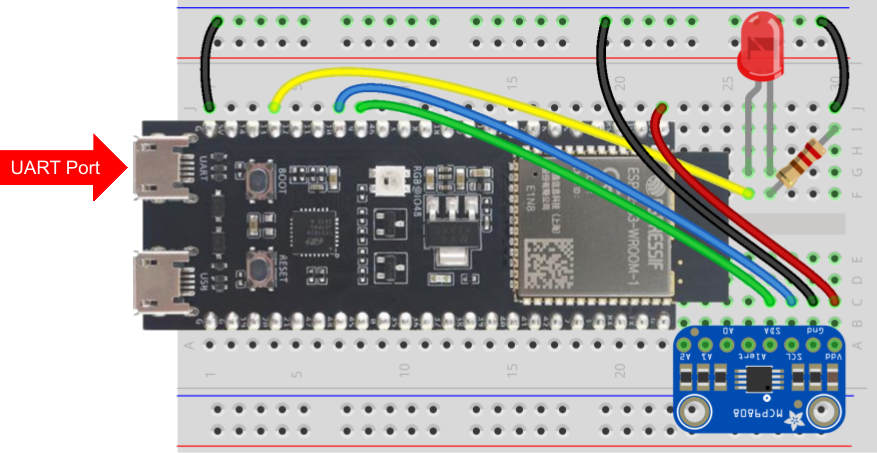
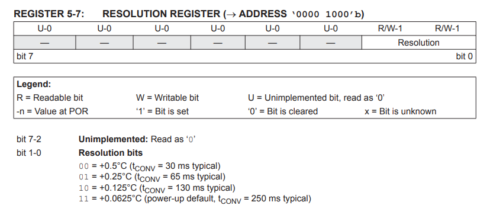
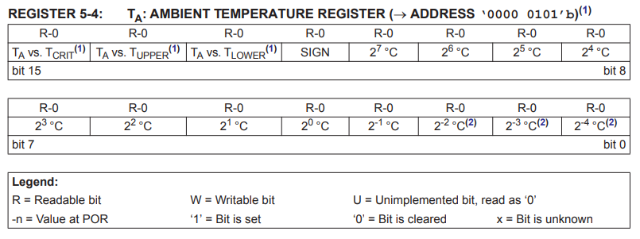
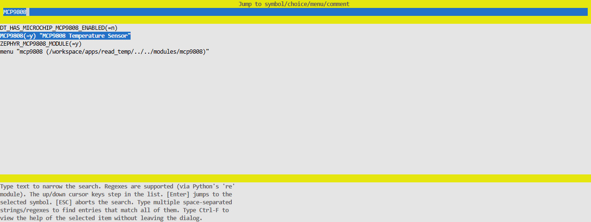
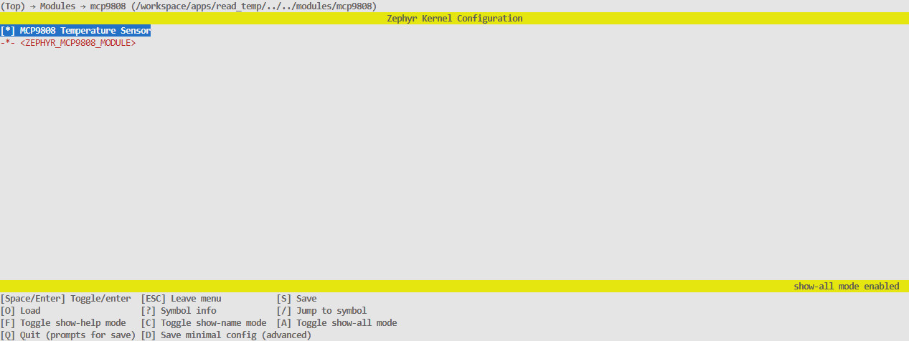
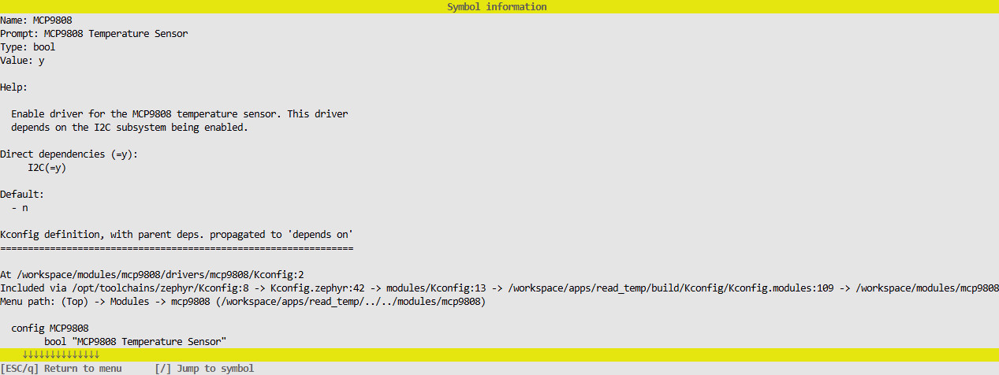
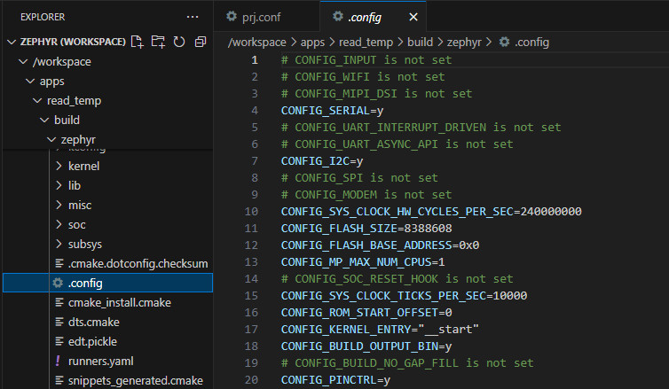
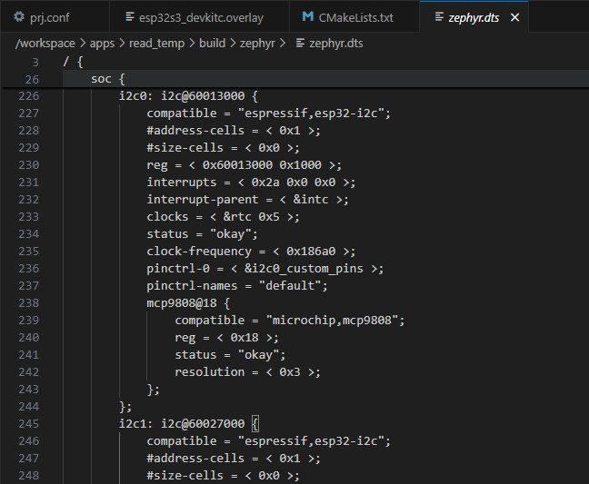
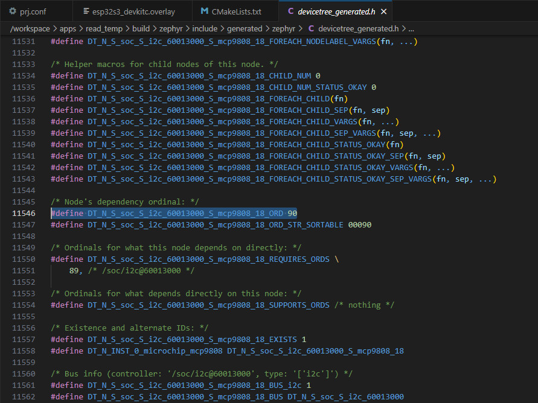
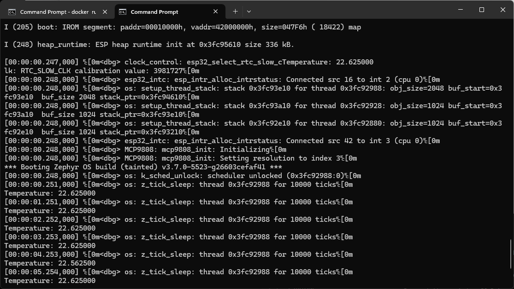

# Workshop: Zephyr Device Driver

Welcome to the Zephyr Device Driver workshop! By the end of this workshop, you should have a broad overview of how a device driver is written, connected to the Devicetree, and then used in a simple example application.

> **Note**: This tutorial includes actions and a lot of discussion about the code. Actions will be marked with the ✅ icon. Feel free to skip the descriptions and come back to them later for in-depth explanations.

Writing a device driver involves multiple tools, languages, and configuration file syntaxes. If this is your first time working with Kconfig and Devicetree, know that it will likely be overwhelming at first. This workshop will provide you with a barebones example and then point you to various resources should you wish to dive deeper into these concepts.

> This workshop was tested with Zephyr RTOS v3.7.0.

## Table of Contents

- [Prerequisites](#prerequisites)
- [Hardware Setup](#hardware-setup)
- [Toolchain Installation](#toolchain-installation)
  - [VS Code Server Setup (Recommended)](#vs-code-server-recommended)
  - [Interactive Container](#interactive-container)
- [Build and Flash the Blink Demo](#build-and-flash-the-blink-demo)
- [Driver Directory Structure](#driver-directory-structure)
- [Driver Header](#driver-header)
- [Driver Source Code](#driver-source-code)
  - [Compatible Driver Definition](#compatible-driver-definition)
  - [Logging](#logging)
  - [Functions](#functions)
  - [API Assignment](#api-assignment)
  - [Devicetree Expansion Macro](#devicetree-expansion-macro)
- [CMake Includes](#cmake-includes)
- [Kconfig Settings](#kconfig-settings)
- [Bindings File](#bindings-file)
- [Zephyr Module](#zephyr-module)
- [Demo Application](#demo-application)
  - [CMakeLists.txt](#cmakeliststxt)
  - [prj.conf](#prjconf)
  - [boards/esp32s3_devkitc.overlay](#boardsesp32s3_devkitcoverlay)
  - [src/main.c](#srcmainc)
- [Build and Flash](#build-and-flash)
- [Going Further](#going-further)
- [Challenge](#challenge)
- [License](#license)


## Prerequisites

You should have an understanding of the following:

 * C programming langauge
 * Embedded development (e.g. what a GPIO pin is)
 * I<sup>2</sup>C communication

I recommend the following guides to refresh your knowledge:

 * [C structs](https://www.programiz.com/c-programming/c-structures)
 * [C pointers](https://www.programiz.com/c-programming/c-pointers)
 * [C macros](https://www.programiz.com/c-programming/c-preprocessor-macros)
 * [GPIO example with Zephyr](https://michaelangerer.dev/zephyr/2021/12/21/zephyr-basics-gpio.html)
 * [Overview of I2C](https://learn.sparkfun.com/tutorials/i2c/all)

The following concepts are optional but will help with your understanding of the hands-on portions of the workshop:

 * [Docker](https://www.digikey.com/en/maker/projects/getting-started-with-docker/aa0d4c708c274ffd975f3b427e5c0ce6)
 * [CMake](https://www.internalpointers.com/post/modern-cmake-beginner-introduction)
 * [Kconfig](https://docs.kernel.org/kbuild/kconfig-language.html)
 * [Devicetree](https://docs.nordicsemi.com/bundle/ncs-1.9.2-dev1/page/zephyr/guides/dts/intro.html)
 * [YAML](https://circleci.com/blog/what-is-yaml-a-beginner-s-guide/)

## Hardware Setup

You will need the following hardware components:

 * [ESP32-S3-DevKit-C-1](https://www.digikey.com/en/products/detail/espressif-systems/ESP32-S3-DEVKITC-1-N32R8V/15970965)
 * [MCP9808 Temperature Sensor Board](https://www.digikey.com/en/products/detail/adafruit-industries-llc/1782/4990781)
 * [LED](https://www.digikey.com/en/products/detail/w%C3%BCrth-elektronik/151051RS11000/4490012)
 * [220 Ω Resistor](https://www.digikey.com/en/products/detail/yageo/CFR-25JB-52-220R/1295?s=N4IgTCBcDa5gDARQEIGkC0A5AIiAugL5A)
 * [Jumper Wires](https://www.digikey.com/en/products/detail/adafruit-industries-llc/1957/6827090)
 * [Solderless Breadboard](https://www.digikey.com/en/products/detail/dfrobot/FIT0096/7597069)
 * [USB A to Micro B Cable](https://www.digikey.com/en/products/detail/cvilux-usa/DH-20M50055/13175849)

✅ Connect the components as follows, and connect the ESP32 dev kit to your computer.



## Toolchain Installation

✅ To start, download this repository somewhere on your computer (using `git` or direct download + unzip).

[The Zephyr Project](https://zephyrproject.org/) is not like other IDEs or toolchains: it relies a wide collection of tools with a strong focus on Linux as the host operating system. Windows and macOS are both officially supported, but installing the toolchains on them can be burdensome.

To create a unified experience for this workshop, this tutorial demonstrates everything using the [pre-made VS Code Docker image](https://github.com/ShawnHymel/vscode-env-zephyr).

> **Note**: In all cases, you should mount the *workspace/* directory from this repository into the container (which we do with the `-v` argument). That gives us a place to modify/save code so that you can take it with you after the workshop.

> **Warning**: I recommend deleting the container after using it (hence the `--rm` argument) to keep everything clean. Any changes in the container outside of the */workspace/* directory (which we mount from the host) **will be deleted**!

(Optional) If you do not want to use Docker, you are welcome to install Zephyr manually on your host operating system by [following these instructions](https://docs.zephyrproject.org/latest/develop/getting_started/index.html). Be warned: the installation locations might affect the flow of this workshop, and you will likely spend some time correcting paths. Zephyr, by default, wants you to install all the RTOS source code and SDK toolchains inside your single, large project. This is an extremely bloated way to develop one-off, smaller projects. As a result, we'll be using something similar to their [T3: Forest topology directory structure](https://docs.zephyrproject.org/latest/develop/west/workspaces.html#t3-forest-topology).

> **Note**: the instructions below were verified with Python 3.12 running on the host system. If one of the *pip install* steps fails, try installing exactly Python 3.12 and running the command again with `python3.12 -m pip install ...`

✅ Before you start, install the following programs on your computer:

 * (Windows) [WSL 2](https://learn.microsoft.com/en-us/windows/wsl/install)
 * [Docker Desktop](https://www.docker.com/products/docker-desktop/)
 * [Python](https://www.python.org/downloads/)

✅ Open a terminal, navigate to this directory, and install the following dependencies:

Linux/macOS:

```sh
cd workshop-zephyr-device-driver/
python -m venv venv
source venv/bin/activate
python -m pip install pyserial==3.5 esptool==4.8.1
```

Windows:

```bat
cd workshop-zephyr-device-driver/
python -m venv venv
venv\Scripts\activate
python -m pip install pyserial==3.5 esptool==4.8.1
```

✅ Load the Docker image using one of the following two options.

**Option 1**: Build the Docker image (this will take some time):

```sh
docker build -t env-zephyr-espressif -f Dockerfile.espressif .
```

**Option 2**: Load a pre-made Docker image

If this is an in-person workshop, I should have USB flash drives with the necessary installers and pre-made images, as conference WiFi connections can sometimes be spotty. Copy the Docker image for your architecture (`*-amd64.tar` for x86_64 processors or `*-arm64.tar` for ARM64 processors like the Mac M1, M2, etc.) to your computer (e.g. *Downloads/* directory). Run the following command to load the Docker image (where `<ARCH>` is either `amd64` or `arm64`):

```sh
cd Downloads/
docker load -i env-zephyr-espressif-<ARCH>.tar
```

The Docker image includes all of the necessary Zephyr RTOS and SDK elements, the toolchain for building ESP32 applications, and a VS Code Server instance. As a result, you have a few options for interacting with the image: VS Code Server or Interactive Container. Choose one from below:

### VS Code Server (Recommended)

> **Note**: The rest of this tutorial assumes you will be using this method.

✅ Open a terminal (or command prompt), navigate to this directory and run the Docker image:

Linux/macOS:

```sh
docker run --rm -it -p 8800:8800 -v "$(pwd)"/workspace:/workspace -w /workspace env-zephyr-espressif
```

Windows:

```bat
docker run --rm -it -p 8800:8800 -v "%cd%\workspace":/workspace -w /workspace env-zephyr-espressif
```

Leave that terminal window open, as it will act as our server. Open a browser on your host OS (verified working on Chrome) and navigate to [localhost:8800](http://localhost:8800/). It should connect to the container's server, and you should be presented with a VS Code instance.

### Interactive Container

If you don't want to use the VS Code server, your other option is to run an interactive container and edit your *workspace/* files locally (using your favorite editor) or in the container (using e.g. vim, nano, mcedit). To do that, override the entrypoint for the image:

Linux/macOS:

```sh
cd workshop-zephyr-device-driver/
docker run --rm -it -v "$(pwd)"/workspace:/workspace -w /workspace --entrypoint /bin/bash env-zephyr-espressif
```

Windows:

```bat
cd workshop-zephyr-device-driver/
docker run --rm -it -v "%cd%\workspace":/workspace -w /workspace --entrypoint /bin/bash env-zephyr-espressif
```

You should be presented with a root shell prompt (`#`) in your terminal. Remember that the */workspace/* directory is shared between your host and container, so any changes to files there are reflected on both systems. You can edit files locally (with e.g. your own local VS Code) or in the container (e.g. `mcedit /workspace/apps/blink/src/main.c`).

## Build and Flash the Blink Demo

Before we start driver development, let's make sure we can build the basic blinky demo.

> **Important!** Take note of the two directories in your VS Code instance:
> * ***/workspace*** is the shared directory between your host and container.
> * ***/opt/toolchains/zephyr*** is the Zephyr RTOS source code. It is for reference only and should not be modified!

✅ Open a terminal in the VS Code client and build the project. Note that I'm using the [ESP32-S3-DevKitC](https://docs.espressif.com/projects/esp-idf/en/stable/esp32s3/hw-reference/esp32s3/user-guide-devkitc-1.html) as my target board. Feel free to change it to one of the [other ESP32 dev boards](https://docs.zephyrproject.org/latest/boards/index.html#vendor=espressif).

> **Note**: Whenever you see the root bash prompt (`#`), it means you should enter those commands into a terminal in the container (browser-based VS Code instance or root shell).

```
# cd apps/blink
# west build -p always -b esp32s3_devkitc/esp32s3/procpu -- -DDTC_OVERLAY_FILE=boards/esp32s3_devkitc.overlay
```

With some luck, the *blink* sample should build. Pay attention to any errors you see.


The binary files will be in *workspace/apps/blink/build/zephyr*, which you can flash using [esptool](https://docs.espressif.com/projects/esptool/en/latest/esp32/).

✅ Connect a USB cable from your computer to the **UART** port on the ESP32-S3-DevKitC. In a new terminal on your **host computer**, activate the Python virtual environment (Linux/macOS: `source venv/bin/activate`, Windows: `venv\Scripts\activate`) if not done so already.

✅ Flash the binary to your board. For some ESP32 boards, you need to put it into bootloader by holding the *BOOTSEL* button and pressing the *RESET* button (or cycling power). Change `<PORT>` to the serial port for your ESP32 board (e.g. `/dev/ttyS0` for Linux, `/dev/tty.usbserial-1420` for macOS, `COM7` for Windows). You might also need to install a serial port driver, depending on the particular board.

> **Important!** make sure to execute flashing and serial monitor programs from your **host OS** (not from within the Docker container)


```sh
python -m esptool --port "<PORT>" --chip auto --baud 921600 --before default_reset --after hard_reset write_flash -u --flash_mode keep --flash_freq 40m --flash_size detect 0x0 workspace/apps/blink/build/zephyr/zephyr.bin
```


✅ Open a serial port for debugging (change `<PORT>` to the serial port for your ESP32 board):

```sh
python -m serial.tools.miniterm "<PORT>" 115200
```

You should see the LED state printed to the console. Exit with *ctrl+]* (or *cmd+]* for macOS).


## Driver Directory Structure

Drivers in Zephyr require a very particular directory structure, as the C compiler, CMake, Kconfig, and the Devicetree Compiler (DTC) browse through folders recursively looking for their respective source files. By default, Zephyr wants you to develop drivers and board Devicetree source (DTS) files "in-tree," which means inside the Zephyr RTOS source code repository (located at */opt/toolchains/zephyr* for this workshop).

For large projects, this might make sense: you fork the main Zephyr repository and make the changes you need in the actual source code. You would then version control your fork of the Zephyr source code (e.g. with [west](https://docs.zephyrproject.org/latest/develop/west/index.html)). For learning purposes, this is a pain.

We are going to develop our device driver "out-of-tree," which means it will be placed in a separate folder that we later tell CMake to find when building the project. This will help keep the application and driver folders free of clutter so you can see what's going on.

✅ To start, create the following directory and file structure in the */workspace/modules/* directory. You can do this with the VS Code instance or using `mkdir` and `touch` in the terminal. Folders end with `/` and files do not. We're just creating a skeleton right now: the files can be empty.

```
modules/
├── README.md
└── mcp9808/
    ├── CMakeLists.txt
    ├── Kconfig
    ├── drivers/
    │   ├── CMakeLists.txt
    │   ├── Kconfig
    │   └── mcp9808/
    │       ├── CMakeLists.txt
    │       ├── Kconfig
    │       ├── mcp9808.c
    │       └── mcp9808.h
    ├── dts/
    │   └── bindings/
    │       └── sensor/
    │           └── microchip,mcp9808.yaml
    └── zephyr/
        └── module.yaml
```

Some notes about the files and folder structure:

 * We're keeping things separate: application code goes in *apps/* and driver code goes in *modules/*.
 * The *CMakeLists.txt* files tell the CMake build system where to find the code for our driver.
 * The *Kconfig* files create an entry in the Kconfig system that allows us to enable, disable, and configure our software components (i.e. the driver code).
 * The *mcp9808.c* and *mcp9808.h* files hold our actual device driver code.
 * The *microchip,mcp9808.yaml* file is our *Devicetree bindings* file. It is the glue that helps connect Devicetree settings (in DTS syntax) to our code (in C). It uses the [YAML syntax](https://docs.ansible.com/ansible/latest/reference_appendices/YAMLSyntax.html) and can end in *\*.yaml* or *\*.yml*. 
 * The *dts/bindings/sensor/* naming and structure matters. During the build process, Zephyr looks for bindings files (\*.yaml) recursively in *dts/bindings/* folders in its *modules*.
 * Speaking of modules, the *zephyr/module.yml* file formally declares this directory (*modules/mcp9808/*) as a Zephyr [module](https://docs.zephyrproject.org/latest/develop/modules.html) so it knows where to find the source, Kconfig, and bindings files. Once again, the folder and file name are important here: Zephyr looks for this particular file in this particular directory. It also uses the YAML syntax and must be named *module.yaml* or *module.yml*.

> **Note**: The device driver used in this example is based on the existing *zephyr/drivers/sensor/jedec/jc42* driver, with the bindings file found in *zephyr\dts\bindings\sensor\jedec,jc-42.4-temp.yaml*. We drop interrupt/trigger support and pare it down to just the essentials to demonstrate how to create an *out-of-tree* driver module. 

## Driver Header

After setting up the directory structure, we're going to write our actual driver. Let's start with our header file.

✅ Copy the following to ***modules/mcp9808/drivers/mcp9808/mcp9808.h***:

```c
#ifndef ZEPHYR_DRIVERS_SENSOR_MICROCHIP_MCP9808_H_
#define ZEPHYR_DRIVERS_SENSOR_MICROCHIP_MCP9808_H_

#include <zephyr/drivers/sensor.h>

// MCP9808 registers
#define MCP9808_REG_CONFIG     0x01
#define MCP9808_REG_TEMP_AMB   0x05
#define MCP9808_REG_RESOLUTION 0x08

// Ambient temperature register information
#define MCP9808_TEMP_SCALE_CEL 16
#define MCP9808_TEMP_SIGN_BIT  BIT(12)
#define MCP9808_TEMP_ABS_MASK  0x0FFF

// Sensor data
struct mcp9808_data {
	uint16_t reg_val;
};

// Configuration data
struct mcp9808_config {
	struct i2c_dt_spec i2c;
	uint8_t resolution;
};

#endif /* ZEPHYR_DRIVERS_SENSOR_MICROCHIP_MCP9808_H_ */
```

There is not much here! We define some constant values and a couple of structs. The weirdest thing is the lack of public-facing functions. In most C/C++ projects, we define our API in the header file that we then `#include` in our application (or other source files). In our driver, we are going to rely on the Devicetree to define our public-facing API. We'll see how to do that in the .c file. For now, know that almost all driver functions should be private (defined as `static`) in the source (.c) file(s).

We define our I2C device register addresses, as given by the [MCP9808 datasheet](https://ww1.microchip.com/downloads/en/DeviceDoc/MCP9808-0.5C-Maximum-Accuracy-Digital-Temperature-Sensor-Data-Sheet-DS20005095B.pdf). The MCP9808 has a number of extra functions that we will ignore for this workshop--namely the ability to set thresholds and toggle an interrupt trigger pin. We want to focus on the simple actions of setting the *RESOLUTION* register at boot time and then reading from the *AMBIENT TEMPERATURE* register at regular intervals.

The RESOLUTION register (address 0x08) uses just 2 bits to set the resolution. We'll create an *enum* in the Devicetree that allows users to set the resolution to one of the four available values. Our driver code will read the value from the Devicetree configuration and set the desired resolution in the register during boot initialization.



The AMBIENT TEMPERATURE register (address 0x05) stores temperature data in 12-bit format with an extra bit used for the sign. We'll ignore bits 13-15, as they're used for setting thresholds. This is a 16-bit register, so we'll read from the register and conver the 12-bit temperature value (plus sign bit) to a usable value in our code.



## Driver Source Code

✅ Copy the following code into ***modules/mcp9808/drivers/mcp9808/mcp9808.c***:

```c
// Ties to the 'compatible = "microchip,mcp9808"' node in the Devicetree
#define DT_DRV_COMPAT microchip_mcp9808

#include <errno.h>
#include <zephyr/drivers/i2c.h>
#include <zephyr/sys/byteorder.h>
#include <zephyr/logging/log.h>

#include "mcp9808.h"

// Enable logging at a given level
LOG_MODULE_REGISTER(MCP9808, CONFIG_SENSOR_LOG_LEVEL);

//------------------------------------------------------------------------------
// Forward declarations

static int mcp9808_reg_read(const struct device *dev,
							uint8_t reg,
							uint16_t *val);
static int mcp9808_reg_write_8bit(const struct device *dev,
								  uint8_t reg,
								  uint8_t val);
static int mcp9808_init(const struct device *dev);
static int mcp9808_sample_fetch(const struct device *dev,
								enum sensor_channel chan);
static int mcp9808_channel_get(const struct device *dev,
							   enum sensor_channel chan,
							   struct sensor_value *val);

//------------------------------------------------------------------------------
// Private functions

// Read from a register (at address reg) on the device
static int mcp9808_reg_read(const struct device *dev, 
							uint8_t reg, 
							uint16_t *val)
{
	const struct mcp9808_config *cfg = dev->config;

	// Write the register address first then read from the I2C bus
	int rc = i2c_write_read_dt(&cfg->i2c, &reg, sizeof(reg), val, sizeof(*val));
	if (rc == 0) {
		*val = sys_be16_to_cpu(*val);
	}

	return rc;
}

// Write to a register (at address reg) on the device
static int mcp9808_reg_write_8bit(const struct device *dev, 
								  uint8_t reg, 
								  uint8_t val)
{
	const struct mcp9808_config *cfg = dev->config;

	// Construct 2-bute message (address, value)
	uint8_t buf[2] = {
		reg,
		val,
	};

	// Perform write operation
	return i2c_write_dt(&cfg->i2c, buf, sizeof(buf));
}

// Initialize the MCP9808 (performed by kernel at boot)
static int mcp9808_init(const struct device *dev)
{
	const struct mcp9808_config *cfg = dev->config;
	int rc = 0;

	// Print to console
	LOG_DBG("Initializing");

	// Check the bus is ready and there is a software handle to the device
	if (!device_is_ready(cfg->i2c.bus)) {
		LOG_ERR("Bus device is not ready");
		return -ENODEV;
	}

	// Set temperature resolution (make sure we can write to the device)
	rc = mcp9808_reg_write_8bit(dev, MCP9808_REG_RESOLUTION, cfg->resolution);
	LOG_DBG("Setting resolution to index %d", cfg->resolution);
	if (rc) {
		LOG_ERR("Could not set the resolution of mcp9808 module");
		return rc;
	}

	return rc;
}

//------------------------------------------------------------------------------
// Public functions (API)

// Read temperature value from the device and store it in the device data struct
// Call this before calling mcp9808_channel_get()
static int mcp9808_sample_fetch(const struct device *dev, 
								enum sensor_channel chan)
{
	struct mcp9808_data *data = dev->data;

	// Check if the channel is supported
	if ((chan != SENSOR_CHAN_ALL) && (chan != SENSOR_CHAN_AMBIENT_TEMP)) {
		LOG_ERR("Unsupported channel: %d", chan);
		return -ENOTSUP;
	}

	// Perform the I2C read, store the data in the device data struct
	return mcp9808_reg_read(dev, MCP9808_REG_TEMP_AMB, &data->reg_val);
}

// Get the temperature value stored in the device data struct
// Make sure to call mcp9808_sample_fetch() to update the device data
static int mcp9808_channel_get(const struct device *dev, 
							   enum sensor_channel chan,
			    			   struct sensor_value *val)
{
	const struct mcp9808_data *data = dev->data;

	// Convert the 12-bit two's complement to a signed integer value
	int temp = data->reg_val & MCP9808_TEMP_ABS_MASK;
	if (data->reg_val & MCP9808_TEMP_SIGN_BIT) {
		temp = -(1U + (temp ^ MCP9808_TEMP_ABS_MASK));
	}

	// Check if the channel is supported
	if (chan != SENSOR_CHAN_AMBIENT_TEMP) {
		LOG_ERR("Unsupported channel: %d", chan);
		return -ENOTSUP;
	}

	// Store the value as integer (val1) and millionths (val2)
	val->val1 = temp / MCP9808_TEMP_SCALE_CEL;
	temp -= val->val1 * MCP9808_TEMP_SCALE_CEL;
	val->val2 = (temp * 1000000) / MCP9808_TEMP_SCALE_CEL;

	return 0;
}

//------------------------------------------------------------------------------
// Devicetree handling - This is the magic that connects this driver source code
// 	to the Devicetree so that you can use it in your application!

// Define the public API functions for the driver
static const struct sensor_driver_api mcp9808_api_funcs = {
	.sample_fetch = mcp9808_sample_fetch,
	.channel_get = mcp9808_channel_get,
};

// Expansion macro to define the driver instances
// If inst is set to "42" by the Devicetree compiler, this macro creates code
// with the unique id of "42" for the structs, e.g. mcp9808_data_42.
#define MCP9808_DEFINE(inst)                                        		   \
																			   \
	/* Create an instance of the data struct */								   \
	static struct mcp9808_data mcp9808_data_##inst;                 		   \
                                                                    		   \
	/* Create an instance of the config struct and populate with DT values */  \
	static const struct mcp9808_config mcp9808_config_##inst = {			   \
		.i2c = I2C_DT_SPEC_INST_GET(inst),                          		   \
		.resolution = DT_INST_PROP(inst, resolution),               		   \
	};        																   \
                                                                    		   \
	/* Create a "device" instance from a Devicetree node identifier and */	   \
	/* registers the init function to run during boot. */					   \
	SENSOR_DEVICE_DT_INST_DEFINE(inst, 										   \
								 mcp9808_init, 								   \
								 NULL, 										   \
								 &mcp9808_data_##inst,						   \
				     			 &mcp9808_config_##inst, 					   \
								 POST_KERNEL,                       		   \
				     			 CONFIG_SENSOR_INIT_PRIORITY, 				   \
								 &mcp9808_api_funcs);						   \

// The Devicetree build process calls this to create an instance of structs for 
// each device (MCP9808) defined in the Devicetree Source (DTS)
DT_INST_FOREACH_STATUS_OKAY(MCP9808_DEFINE)
```

There is a lot going on here, so we'll discuss the code in the following subsections. 

> **Note**: These discussions are quite lengthy. Feel free to skip them if you just want to get a working driver.

### Compatible Driver Definition

```c
// Ties to the 'compatible = "microchip,mcp9808"' node in the Devicetree
#define DT_DRV_COMPAT microchip_mcp9808
```

We define the *compatible* name as `microchip_mcp9808` using the `DT_DRV_COMPAT` macro, which is a special macro provided by Zephyr. Because I2C is a bus architecture, we could have multiple MCP9808 devices attached to the same bus (each with its own bus address). To handle this (without relying on object-oriented programming e.g. C++), we must create *instances* of our driver config, data, and API functions that exist separately of each other when we compile our code. Zephyr gives us a series of macros to help us create these instances.

You can create non-instance driver code, but we'll rely on [Zephyr's instance-based driver macros](https://docs.zephyrproject.org/latest/build/dts/howtos.html#option-1-create-devices-using-instance-numbers) to help us handle multiple I2C devices on the same bus. To use them, you must define `DT_DRV_COMPAT` before calling the instance expansion macros (found at the bottom of the code). During the build process, Zephyr looks for *compatible* symbols in the Devicetree source (DTS) files that match the *compatible* symbols in both the *bindings* files (which we'll explore later) and in the driver source code.

Note that *compatible* is almost always given as `vender,device` as a standard style in Devicetree lingo. As C macro symbols do not work with commas, the comma is converted to an underscore `_` when the build system is looking for matching source code files. In other words, if you use `compatible = "microchip,mcp9808";` in your Devicetree source, you must use `microchip_mcp9808` to define the matching driver source code macro.

### Logging

```c
// Enable logging at a given level
LOG_MODULE_REGISTER(MCP9808, CONFIG_SENSOR_LOG_LEVEL);
```

The `LOG_MODULE_REGISTER` macro enables logging (for debugging and error identification) at the module level (remember, this driver is considered a *module*). We can then use macros like `LOG_DBG` and `LOG_ERR` to print messages to the console:

```c
LOG_ERR // Print ERROR level message to the log
LOG_WRN // Print WARNING level message to the log
LOG_INF // Print INFO level message to the log
LOG_DBG // Print DEBUG level message to the log
```

We can use the Kconfig system to set the log level (0-4) for our program:

 0. None
 1. Error
 2. Warning
 3. Info
 4. Debug

Note that messages at and *below* the configured log level will be printed. For example, setting the log level to 2 will print all `LOG_WRN` and `LOG_ERR` messages, but it will not print `LOG_INF` and `LOG_DBG` messages.

### Functions

```c
static int mcp9808_reg_read(const struct device *dev,
							uint8_t reg,
							uint16_t *val);
...
```

Next, we declare our functions. Note the use gratuitous use of `static` here; we want to keep these functions *private*, which means that they can only be seen by the compiler inside this file. To illistrate how a Zephyr driver *API* works, I divided the functions into *private* and *public* sections, but notice that they are still all declared as `static`.

From there, we define our functions. The register reading and writing should be familiar if you've worked with I2C devices before. If not, I recommend reading [this introduction to I2C](https://learn.sparkfun.com/tutorials/i2c/all). In these functions, we call Zephyr's I2C API to handle the low-level functions for us.

> **Note**: Zephyr's I2C API offers a great layer of abstraction! We are not bound to using a specific chip or board hardware abstraction layer (HAL). Rather, Zephyr links to the necessary chip-specific HAL at build time when we specify the board (e.g. `west build -b <board>`). As a result, we can write truly device-agnostic driver code!

To learn about the available I2C functions, you can either navigate to the I2C header file (*zephyr/include/zephyr/drivers/i2c.h*) or view the [API docs here](https://docs.zephyrproject.org/apidoc/latest/group__i2c__interface.html).

The interesting part is that we are creating *instance-specific* functions without the use of object-oriented programming. To do that, the I2C functions expect a `i2c_dt_spec` struct as their first parameter, which holds the bus (e.g. `i2c0` or `i2c1`) and device address (e.g. `0x18` for the MCP9808). These are values that get populated from the Devicetree source, rather than from your application code. For example:

```c
int rc = i2c_write_read_dt(&cfg->i2c, &reg, sizeof(reg), val, sizeof(*val));
```

Here, we perform the common pattern of writing a register address (`reg`) out to the device (at I2C address `i2c->addr`) and then reading the value from the register, which is saved to the `val` variable.

A common pattern in Zephyr is to save output values in parameters and use the return value to send a *return code* back to the caller. These codes are defined by [POSIX.1-2017](https://pubs.opengroup.org/onlinepubs/9699919799.2018edition/) and can be found in [here in the Zephyr docs](https://docs.zephyrproject.org/apidoc/latest/group__system__errno.html).

The `init` function will be registered to the kernel's boot process, and is (normally) called once prior to the application's `main()` being called.

The *public functions* adhere to the [Zephyr Sensor API template](https://docs.zephyrproject.org/apidoc/latest/structsensor__driver__api.html), which can be found in *zephyr/include/zephyr/drivers/sensor.h*. We will assign these functions to a *sensor_driver_api* struct to enforce the use of this template. While we could define our own structs, the use of such templates provide common patterns for application developers. In other words, all Zephyr *sensors* will work in similar ways.

In particular, we will define the following public API functions:

 * `sample_fetch` - The sensor takes a reading for the given channel (e.g. temperature, humidity, acceleration X, acceleration Y, etc.) and stores it in the `device` struct's `data` field.
 * `channel_get` - Get the value of the desired channel that is currently stored in the `device->data` field.

### API Assignment

```c
// Define the public API functions for the driver
static const struct sensor_driver_api mcp9808_api_funcs = {
	.sample_fetch = mcp9808_sample_fetch,
	.channel_get = mcp9808_channel_get,
};
```

After we've declared (and/or defined) our public-facing functions, we assign them to the various fields in the `sensor_driver_api` struct. In a minute, we'll use this API struct to create a *device* instance that can be called from our application code.

### Devicetree Expansion Macro

```c
#define MCP9808_DEFINE(inst)                                        		   \
																			   \
	/* Create an instance of the data struct */								   \
	static struct mcp9808_data mcp9808_data_##inst;                 		   \
                                                                    		   \
	/* Create an instance of the config struct and populate with DT values */  \
	static const struct mcp9808_config mcp9808_config_##inst = {			   \
		.i2c = I2C_DT_SPEC_INST_GET(inst),                          		   \
		.resolution = DT_INST_PROP(inst, resolution),               		   \
	};        																   \
                                                                    		   \
	/* Create a "device" instance from a Devicetree node identifier and */	   \
	/* registers the init function to run during boot. */					   \
	SENSOR_DEVICE_DT_INST_DEFINE(inst, 										   \
								 mcp9808_init, 								   \
								 NULL, 										   \
								 &mcp9808_data_##inst,						   \
				     			 &mcp9808_config_##inst, 					   \
								 POST_KERNEL,                       		   \
				     			 CONFIG_SENSOR_INIT_PRIORITY, 				   \
								 &mcp9808_api_funcs);	
```

This is the magic that connects our code to the Devicetree. So long as the `DT_DRV_COMPAT` macro has been defined prior, the Zephyr build system generates instance-based C code. It relies heavily on [macro token concatenation](https://gcc.gnu.org/onlinedocs/cpp/Concatenation.html), also known as *token pasting*.

The Zephyr build system automatically assigns *instance* numbers to Devicetree nodes when there are multiple instances of that node under a parent node (e.g. multiple I2C devices under an I2C bus node). We will see this in action later.

During this build process, the preprocessor takes that instance number and generates C code, defining the data, functions, etc. for that instance. For example, if we define an MCP9808 device in the Devicetree, the build system will assign it an instance number (e.g. 42). The preprocessor will then generate the code from this macro as follows:

```c
/* Create an instance of the data struct */
static struct mcp9808_data mcp9808_data_42;

/* Create an instance of the config struct and populate with DT values */
static const struct mcp9808_config mcp9808_config_42 = {
    .i2c = I2C_DT_SPEC_INST_GET(42),
    .resolution = DT_INST_PROP(42, resolution),
};

/* Create a "device" instance from a Devicetree node identifier and */
/* registers the init function to run during boot. */
SENSOR_DEVICE_DT_INST_DEFINE(42,
                             mcp9808_init,
                             NULL,
                             &mcp9808_data_42,
                             &mcp9808_config_42,
                             POST_KERNEL,
                             CONFIG_SENSOR_INIT_PRIORITY,
                             &mcp9808_api_funcs);
```

This macro is fed into the `FOREACH` macro as an argument:

```c
DT_INST_FOREACH_STATUS_OKAY(MCP9808_DEFINE)
```

This `FOREACH` macro tells the preprocessor to generate structs/functions for each instance found in the Devicetree (as long as its `status` property is set to `"okay"`).

## CMake Includes

We need to tell the build system where to find the source files. As Zephyr relies on *CMake*, that involves creating a *CMakeLists.txt* file in each of the folders leading up to the actual *.h* and *.c* files.

> **Note**: Zephyr defines a number of extra macros and functions that extend/customize CMake. You can find them in the [zephyr/cmake/modules/extensions.cmake](https://github.com/zephyrproject-rtos/zephyr/blob/main/cmake/modules/extensions.cmake) file. 

✅ Copy the following to ***modules/mcp9808/drivers/mcp9808/CMakeLists.txt***:

```cmake
# Declares the current directory as a Zephyr library
# If no name is given, the name is derived from the directory name
zephyr_library()

# List the source code files for the library
zephyr_library_sources(mcp9808.c)
```

✅ Copy the following to ***modules/mcp9808/drivers/CMakeLists.txt***:

```cmake
# Custom Zephyr function that imports the mcp9808/ subdirectory if the Kconfig
# option MCP9808 is defined
add_subdirectory_ifdef(CONFIG_MCP9808 mcp9808)
```

✅ Copy the following to ***modules/mcp9808/CMakeLists.txt***:

```cmake
# Include the required subdirectories
add_subdirectory(drivers)

# Add subdirectories to the compiler's include search path (.h files)
zephyr_include_directories(drivers)
```

## Kconfig Settings

[Kconfig](https://docs.zephyrproject.org/latest/build/kconfig/index.html) is a system for configuring various software components in Zephyr and is based on the Kconfig system used for Linux. Most notably, it is used to enable/disable components (like our MCP9808 driver) as well as set various parameters.

We will define an "MCP9808" option in Kconfig that can be enabled to include the driver source code. This kind of module system helps keep the final application binary relatively small.

✅ Copy the following to ***modules/mcp9808/drivers/mcp9808/Kconfig***:

```conf
# Create a new option in menuconfig
config MCP9808
	bool "MCP9808 Temperature Sensor"
	default n  		# Set the driver to be disabled by default
	depends on I2C  # Make it dependent on I2C
	help
	  Enable driver for the MCP9808 temperature sensor. This driver
	  depends on the I2C subsystem being enabled.
```

This creates a new option in our Kconfig system with the symbol *MCP9808*. The second line defines this as a boolean (with =y or =n as the only options). It also sets the default to `n` (disabled) and makes it depend on the I2C system being enabled.

✅ Copy the following to ***modules/mcp9808/drivers/Kconfig***:

```conf
rsource "mcp9808/Kconfig"
```

Like with CMake, we need to tell Kconfig where to find the relevant Kconfig files. This one says to look in the *relative* source (`rsource`) of the *mcp9808/* subdirectory for a file named *Kconfig*.

✅ Copy the following to ***modules/mcp9808/Kconfig***:

```conf
rsource "drivers/Kconfig"
```

This says to look in the *drivers/* subdirectory for a relevant *Kconfig* file.

Together, these files help the Zephyr build system find new (or modifications to) Kconfig options relevant to our driver.

## Bindings File

In order to connect the Devicetree settings to the driver source code so you can use it in your application, you need to create a *bindings* file. These files use the [YAML syntax](https://docs.ansible.com/ansible/latest/reference_appendices/YAMLSyntax.html) and create a specification for the various Devicetree properties that define the device.

✅ Copy the following to ***modules/mcp9808/dts/bindings/sensor/microchip,mcp9808.yaml***:

```yaml
# Description of the device
description: Microchip MCP9808 temperature sensor

# Compatibility string that matches the one in the Devicetree source and 
# DT_DRV_COMPAT macro in the driver source code
compatible: "microchip,mcp9808"

# Includes common definitions from other bindings files
#  - sensor-device.yaml - common sensor properties
#  - i2c-device.yaml - common I2C communication properties
include: [sensor-device.yaml, i2c-device.yaml]

# Defines specific Devicetree properties of the MCP9808 sensor
properties:
  resolution:
    type: int
    default: 3
    description: Sensor resolution. Default is 0.0625°C (3).
    enum:
      - 0 # 0.5°C
      - 1 # 0.25°C
      - 2 # 0.125°C
      - 3 # 0.0625°C
```

The bindings file must define a `compatible` field. The Zephyr build system looks for this string when parsing the Devicetree source files to know what bindings (i.e. interface) to use for a given node and its associated properties. Note that the filename of the bindings file does not matter; it is this field that matters!

We also include other bindings files here to enumerate common properties found in the *sensor* and *i2c-device* bindings.

In this example, we define a custom *property* (`resolution`) in addition to the ones given by the *sensor-device* and *i2c-device* bindings. It's best to think about these bindings files as defining an interface for *nodes* in the Devicetree: it specifies the required properties, their types, possible defaults, and (optionally) acceptable values.

Even though we specify these properties in YAML syntax, we will define Devicetree nodes in Devicetree source (DTS) syntax. You can read more about writing DTS files in [this helpful Zephyr guide](https://docs.zephyrproject.org/latest/build/dts/intro-syntax-structure.html).

## Zephyr Module

We've created the required files that define the necessary device driver, at least according to what CMake, Kconfig, the Devicetree, and the compiler want. The final piece is telling Zephyr that it should treat all of these files and folders as a *module*. If we don't do this, Zephyr will fail to build and link to our driver code. Creating a Zephyr module is relatively straightforward: we just need a *zephyr/module.yaml* file in the top directory of our directory structure.

✅ Copy the following to ***modules/mcp9808/zephyr/module.yaml***:

```yaml
name: mcp9808
build:
  cmake: .
  kconfig: Kconfig
  settings:
    dts_root: .
```

The first key-value pair specifies the `name` of the module: *mcp9808*. We then specify how the module should be built with the `build` section:

 * `cmake` - tells the Zephyr build system where to look for CMake files (relative to the module's root directory)
 * `kconfig` - path to the *Kconfig* file in the module's root directory
 * `settings` - additional settings that Zephyr should know about
   * `dts_root` - Zephyr will look for a *dts/* directory at this location and search in there for additional Devicetree source (.dts) and bindings (.yaml, .yml) files

You can read more about [Zephyr modules here](https://docs.zephyrproject.org/latest/develop/modules.html).

## Demo Application

With our module constructed, we're ready to write a simple application to test our device driver!

✅ Create the following directory and file structure for our *read_temp* application in the */workspace/apps/* directory (*blink/* shown for reference):

```
apps/
├── blink/
│   └── ...
└── read_temp/
    ├── CMakeLists.txt
    ├── prj.conf
    ├── boards/
    │   └── esp32s3_devkitc.overlay
    └── src/
        └── main.c
```

Let's fill out these files and discuss their contents.

### CMakeLists.txt

✅ Copy the following to ***apps/read_temp/CMakeLists.txt***:

```cmake
# Minimum CMake version
cmake_minimum_required(VERSION 3.20.0)

# Add additional modules
set(ZEPHYR_EXTRA_MODULES "${CMAKE_SOURCE_DIR}/../../modules/mcp9808")

# Locate the Zephyr RTOS source
find_package(Zephyr REQUIRED HINTS $ENV{ZEPHYR_BASE})

# Name the project
project(read_temp)

# Locate the source code for the application
target_sources(app PRIVATE src/main.c)
```

We first define the minimum required version of CMake. We derive this from other *CMakeLists.txt* files found in the Zephyr RTOS source code.

Next, we tell Zephyr where to find our custom *mcp9808* module by setting the `ZEPHYR_EXTRA_MODULES` variable to the module's path. Zephyr will look at this variable during the build process.

From there, we include the Zephyr RTOS source directory as a CMake package. If we configured Zephyr correctly, the `ZEPHYR_BASE` environment variable should be set in our OS. If not, we could use the path to the Zephyr directory instead.

Finally, we name the project and tell CMake where to find our source code files.

I recommend the following resources to learn more about CMake:

 * [CMake's official tutorials](https://cmake.org/cmake/help/latest/guide/tutorial/index.html)
 * [Zephyr Build System](https://docs.zephyrproject.org/latest/build/cmake/index.html)

### prj.conf

✅ Copy the following to ***apps/read_temp/prj.conf***:

```conf
CONFIG_GPIO=y
CONFIG_SENSOR=y
CONFIG_I2C=y
CONFIG_MCP9808=y
CONFIG_LOG=y
CONFIG_LOG_DEFAULT_LEVEL=4
```

As we saw earlier, Zephyr relies on the Kconfig system (borrowed from the [Linux Kconfig system](https://www.kernel.org/doc/html/v6.9/kbuild/kconfig-language.html)) to enable and disable various software components. Defining options, known as *symbols*, involves setting the symbol name (prefixed with `CONFIG_`) to one of the following value types:

 * *Boolean* - `y` for enabled and `n` for disabled
 * *Tristate* - `y`, `n`, or `m` for *loadable modules* (not used much in Zephyr, as modules are only included at build time)
 * *Integer* - Integer value (like our `LOG_DEFAULT_LEVEL`)
 * *Hex* - Similar to an integer but given in hexadecimal format (prefixed with `0x`)
 * *String* - Free-form text input to specify a file path, device name, etc.

Knowing which options to set can be tricky. Zephyr comes with [two interactive Kconfig interfaces](https://docs.zephyrproject.org/latest/build/kconfig/menuconfig.html) to help. *menuconfig* is the classic, command-line style interface while *guiconfig* is meant for graphical interfaces. As we are not running a full, windowed OS on our container, let's try *menuconfig*.

> **Note**: You do not need to perform the following actions. We just want to demonstrate how you might find Kconfig options. We already set them for our project in *prj.conf*.

In a terminal on your VS Code instance (inside the Docker container), navigate to the *apps/read_temp/* directory and build the project with the `-t menuconfig` option:

```sh
# west build -b esp32s3_devkitc/esp32s3/procpu -t menuconfig
```

Note that we need to specify a board (since it has not been set elsewhere) so that Zephyr knows how to set the default options. Since we are building our application for the *esp32s3_devkitc/esp32s3/procpu*, you can find the default configuration settings in *zephyr/boards/espressif/esp32s3_devkitc/*. In that directory, you'll find that *Kconfig.esp32s3_devkitc* specifies the *system-on-chip* (SOC) module found on the board (`ESP32S3_WROOM_N8`) and which processor we are targeting (`PROCPU` or `APPCPU`). The *esp32s3_devkitc_procpu_defconfig* file then adds or modifies the default values set by the SOC's Kconfig files.

We also do not need any application code to run *menuconfig*--we just need a CMakeLists.txt file so that the build system knows where to find Zephyr and our custom module.

You should be presented with a CLI-style graphical interface. Start a search by typing `/` and then enter `MCP9808`. You should see several options related to our MCP9808 driver.



 * *DT_HAS_MICROCHIP_MCP9808* - automatically generated by Zephyr to indicate if the device's module is found on the project's Devicetree. As we have not created our *.overlay* file yet for this project to enable the device, this is (as expected) set to `n`.
 * *MCP9808* - the actual driver module we created earlier. Make sure this is set to `y` (to match what we set in *prj.conf*)
 * *ZEPHYR_MCP9808_MODULE* - Zephyr generates this symbol based on our module name (defined in */modules/mcp9808/zephyr/module.yaml*). It should be enabled (`y`) by default, and we can't change it manually.
 * *menu "mcp9808 (/workspace/apps/read_temp/../../modules/mcp9808)"* - String containing "mcp9808" from our module's description

Use the arrow keys to highlight *MCP9808* and press enter. You should see our custom module entry. You can enable and disable it by pressing the spacebar (`[ ]` for disabled, `[*]` for enabled).



Type `?` to view the module info. Here, you can see all the Kconfig options and descriptions we wrote in our *modules/mcp9808/drivers/mcp9808/Kconfig* file!



Notice that our MCP9808 module depends on the I2C module. If you were to disable the I2C module, you would not be able to enable our module (you can't right now, as too many things depend on I2C).

If you make any settings in menuconfig, you can save by pressing `s`. Note that menuconfig does not save changes in either the base Zephyr project (*/opt/toolchains/zephyr/*) or our *prj.conf* file. Rather, it saves them in *<APP_NAME>/build/zephyr/.config*. 

Open *apps/read_temp/build/zephyr/.config*. You should see ALL of the Kconfig settings--everything pulled in from default Zephyr, our SOC, board, and *prj.conf*. Tracking down the location of each of these options can be tricky, as this file is compiled from dozens of various config files scattered throughout the Zephyr RTOS code, custom modules, and application settings. This is why we use a tool like *menuconfig*--it makes searching for and setting these options much easier.



The important thing to note here is that this file sits in our *build/* directory. This is fine if you don't often make changes to your application's build options, but as we've been building with the `-p always` option, this directory gets deleted/repopulated every time. That's not good: any changes we make with menuconfig will be lost when we build!

There are a number of ways to save this .config file (usually by copying it out to your project folder). My preference is to find which options differ from the default board configuration and set them manually in *prj.conf*. Zephyr looks for a file with this name when building a project and updates the Kconfig options accordingly.

You can read more about [Zephyr's Kconfig settings here](https://docs.zephyrproject.org/latest/build/kconfig/setting.html).

### boards/esp32s3_devkitc.overlay

Even though we enabled the software portion of our module, we still need to set up the Devicetree node so that our driver code knows how to communicate with the physical device. That means defining an I2C address, assigning SDA and SCL pins, and associating the device with a particular I2C bus.

✅ Copy the following to ***apps/read_temp/boards/esp32s3_devkitc.overlay***:

```dts
// Create an alias for our MCP9808 device
/ {
    aliases {
        my-mcp9808 = &mcp9808_18_i2c0;
    };
};

// Add custom pins to the node labeled "pinctrl"
&pinctrl {

	// Configure custom pin settings for I2C bus 0
    i2c0_custom_pins: i2c0_custom_pins {

		// Custom group name
        group1 {
            pinmux = <I2C0_SDA_GPIO9>, <I2C0_SCL_GPIO10>;	// SDA on GPIO9, SCL on GPIO10
            bias-pull-up; 									// Enable pull-up resistors for both pins
            drive-open-drain; 								// Required for I2C
            output-high; 									// Start with lines high (inactive state)
        };
    };
};

// Enable I2C0 and add MCP9808 sensor
&i2c0 {
    pinctrl-0 = <&i2c0_custom_pins>; 						// Use the custom pin configuration
    status = "okay"; 										// Enable I2C0 interface

	// Label: name of our device node
    mcp9808_18_i2c0: mcp9808@18 {
        compatible = "microchip,mcp9808"; 					// Specify device bindings/driver
        reg = <0x18>; 										// I2C address of the MCP9808
        status = "okay"; 									// Enable the MCP9808 sensor
        resolution = <3>; 									// Set the resolution
    };
};
```

Zephyr uses the [Devicetree](https://docs.zephyrproject.org/latest/build/dts/index.html) to configure hardware (and some software) components when building a project. An *overlay* file is a supplementary source file that is used to modify or extend the existing Devicetree source (DTS) files, which are pulled in from various SOC, board, and Zephyr locations (much like the Kconfig files). This is where we set pins and configure our custom MCP9808 module.

> **Note**: Devicetree syntax can be overwhelming at first. I recommend taking a look at [this guide](https://docs.zephyrproject.org/latest/build/dts/intro-syntax-structure.html) to learn more.

Zephyr defines [aliases and chosen nodes](https://zephyr-docs.listenai.com/guides/dts/intro.html#aliases-and-chosen-nodes) in the root node (`/`) that make addressing other subnodes easier. We create an alias to our device node label so that we can easily access that node in our application code. We define the `mcp9808_18_i2c0` label later in the overlay file when we create our node. Note that *alias* names can only contain the characters `[0-9a-z-]`, which means no underscores! C does not like dashes in names, so when we access this alias from code, we'll need to replace the dash `-` with an underscore `_`.

We then assign pins to a pin control group that we plan to use for our I2C bus. The `&` symbol says to access the node with the given label (e.g. `pinctrl`). This node is defined elsewhere for our board, and we just want to modify it.

We create a node (with the syntax `label: node_name`) to group our I2C pins. In there, we define a custom group to configure our pins. We use the pin control names defined in *zephyr/include/zephyr/dt-bindings/pinctrl/esp32s3-pinctrl.h*. This is how the ESP32 assigns functions to pins in Zephyr (e.g. using pins for I2C or UART rather than basic GPIO). 

The `&i2c0` is the label for our I2C bus 0 node on the Devicetree. The actual path is `/soc/i2c@60013000`, which denotes an I2C controller at memory address 0x60013000. This node is set by the SOC configuration. The label `i2c0` is easier to use and makes our code more portable to other processors.

In this node, we overwrite the `pinctrl-0` property with our new custom pin configuration and then enable the I2C0 controller by setting `status = "okay";` (it is set to `"disabled"` by default). This is how we enable an I2C bus on the ESP32 with Zephyr: set the pins and set the status to `"okay"`.

We then create a subnode with the name `mcp9808@18`. The `@18` is a *unit address*--it is optional, but it can help readers understand how a device is addressed on a bus. In this node, we define several *properties*:

 * `compatible` - This required string tells Zephyr where to look for the related bindings and driver files
 * `reg` - Required address of the device on the bus (our MCP9808's default I2C bus address is 0x18)
 * `status` - Required to enable (`"okay"`) or disable (`"disabled"`) the device
 * `resolution` - The custom property we defined in our driver to set the temperature resolution. This value is ultimately passed to the instanced code of our driver, which is then sent to the RESOLUTION register in the *init* function at boot time.

Even though we do not have any application code, you can actually build your project:

```sh
# west build -p always -b esp32s3_devkitc/esp32s3/procpu -- -DDTC_OVERLAY_FILE=boards/esp32s3_devkitc.overlay
```

Note that we pass our overlay file to the build system by setting the `DTC_OVERLAY_FILE` variable. West uses the parameter `--` is used to pass subsequent arguments to the underlyaing CMake system. So, `DTC_OVERLAY_FILE` is used by CMake rather than the overarching *west* system.

Zephyr takes our overlay file and combines it with all of the other Devicetree source (.dts) and Devicetree source include (.dtsi) files it found for our SOC and board. It produces a combined DTS file at *apps/read_temp/build/zephyr/zephyr.dts*. If you open that file and search for "mcp9808," you should be able to find the custom node we created. Notice that it is a subnode of `i2c0`, as it is considered to be attached to that bus.



During the build process, Zephyr creates C macros for all of these device nodes and properties. You can find them defined in *apps/read_temp/build/zephyr/include/generated/zephyr/devicetree_generated.h*. Search for "mcp9808" and you'll find the 100+ macros that Zephyr created.



The macro naming scheme is based on navigating the Devicetree:

 * `DT` - Devicetree
 * `N` - node
 * `S` - slash
 * `P` - property

From this, we can figure out the generated macro for our *resolution* property, which is found at `/soc/i2c@60013000/mcp9808@18{resolution=3}`. This would become `DT_N_S_soc_S_i2c_60013000_S_mcp9808_18_P_resolution` (`@` is not allowed in macro symbols, so it becomes an underscore `_`). Sure enough, if you search for that macro, you'll find it set to `3`.

The other important macro is the `_ORD` macro (highlighted in the image) for our node. This is the *instance* number that Zephyr assigned to our node. Remember our macro magic in the driver code that expands based on each instance of the node? This is that *instance* number. For example, our data struct in the device driver would expand from `mcp9808_data_##inst` to `mcp9808_data_90`.

While this seems like a lot of configuration, it helps create portable device drivers and application code. By making just a few changes to your Devicetree file (and maybe Kconfig), you can port your code to another processor! This is why you'll often see board-specific overlay files in the *boards/* folder of many projects. You can configure one application to build for several different boards.

Zephyr has an [entire series of articles dedicated to the Devicetree](https://docs.zephyrproject.org/latest/build/dts/intro.html), which I highly recommend checking out.

### src/main.c

Finally, after all that configuration, we get to write our application code!

✅ Copy the following to ***apps/read_temp/src/main.c***:

```c
#include <zephyr/kernel.h>
#include <zephyr/device.h>
#include <zephyr/drivers/sensor.h>
#include <stdio.h>

int main(void)
{
	const struct device *const mcp = DEVICE_DT_GET(DT_ALIAS(my_mcp9808));
	int rc;

    // Check if the MCP9808 is found
	if (mcp == NULL) {
		printf("MCP9808 not found.\n");
		return 0;
	}

    // Check if the MCP9808 has been initialized (init function called)
	if (!device_is_ready(mcp)) {
		printf("Device %s is not ready.\n", mcp->name);
		return 0;
	}

    // Loop
    while (1) 
    {
        struct sensor_value tmp;

        // Fetch the temperature value from the sensor into the device's data structure
        rc = sensor_sample_fetch(mcp);
        if (rc != 0) {
            printf("Sample fetch error: %d\n", rc);
            return 0;
        }

        // Copy the temperature value from the device's data structure into the tmp struct
        rc = sensor_channel_get(mcp, SENSOR_CHAN_AMBIENT_TEMP, &tmp);
        if (rc != 0) {
            printf("Channel get error: %d\n", rc);
            return 0;
        }

        // Print the temperature value
        printf("Temperature: %d.%06d\n", tmp.val1, tmp.val2);

        // Sleep for 1 second
        k_sleep(K_SECONDS(1));
    }
    
    return 0;
}
```

The code has been commented to help you understand what is happening. But, I'll call out a few important sections as it relates to our driver.

We get a pointer to the instance of our *mcp9808* driver by using the `DEVICE_DT_GET()` macro. We pass it the value of `DT_ALIAS(my_mcp9808)`, which expands to our Devicetree node given by the alias `my-mcp9808`. Remember that Devicetree aliases cannot contain underscores, and C does not like dashes in macro names. So, Zephyr automatically provides this conversion for us. Also note that we are passing in a macro symbol (`my_mcp9808`) rather than a string (or other C native data type). Zephyr's macro magic uses this symbol to find the associated Devicetree node.

This instance is returned as a *device* struct, which has certain properties defined by Zephyr. You can find this definition in *zephyr/include/zephyr/device.h*. Remember that our MCP9808 driver is a *sensor*, which is a type of *device*. Each of these classifications (sensor, device) provides certain definitions and interface requirements.

Whenever we want to use this device, we call the related functions (whether they are *device* functions, *sensor* functions, or *mcp9808* functions) and pass in a pointer to our `mcp` device struct.

> **Side note**: if this were C++, you'd call the member functions associated with that object. All this instancing macro magic is how Zephyr gets around object-oriented programming.

For our setup code, we first make sure that our MCP9808 instance was found by the `DEVICE_DT_GET()` macro by checking to see if the pointer is `NULL`. We then make sure that `mcp9808_init()` was automatically called during the boot process by checking if `device_is_ready()`.

If you recall from our device driver code, we only have two publically available functions: `sample_fetch` and `channel_get`. OK, we also have the functions, constants, and macros conferred to us by the [Device API](https://docs.zephyrproject.org/apidoc/latest/group__device__model.html) and [Sensor API](https://docs.zephyrproject.org/apidoc/latest/group__sensor__interface.html).

> **Side note**: if you compared this to object-oriented programming, *mcp9808* would be a subclass of *sensor*, which would be a subclass of *device*.

The *sensor* interface declares `sensor_sample_fetch()` and `sensor_channel_get()`. In our driver code, we assigned `mcp9808_sample_fetch()` and `mcp9808_channel_get()` to these functions respectively when we defined `struct sensor_driver_api mcp9808_api_funcs`. So, for example, when we call `sensor_sample_fetch()` in our application code, it actually calls `mcp9808_sample_fetch()` in our driver code.

The basic pattern for working with sensors is to first *fetch* the sample, which causes the sensor to take a reading before storing the result in an internal variable (`dev->data`). You then *get* the channel information, which returns the data stored in `dev->data` for the specified channel (only *ambient tamperature* in our case).

Finally, we print the value and wait 1 second before repeating.
 
## Build and Flash

✅ In the VS Code client, go to the *read_temp* application directory and build the project:

```
# cd apps/read_temp
# west build -p always -b esp32s3_devkitc/esp32s3/procpu -- -DDTC_OVERLAY_FILE=boards/esp32s3_devkitc.overlay
```

Pay attention to any errors you see.

✅ Connect the ESP32 board to your computer (use the **UART** port on the ESP32). In a new terminal on your **host computer**, activate the Python virtual environment (Linux/macOS: `source venv/bin/activate`, Windows: `venv\Scripts\activate`) if not done so already.

✅ Flash the binary to your board.

> **Important!** make sure to execute flashing and serial monitor programs from your **host OS** (not from within the Docker container)


```sh
python -m esptool --port "<PORT>" --chip auto --baud 921600 --before default_reset --after hard_reset write_flash -u --flash_mode keep --flash_freq 40m --flash_size detect 0x0 workspace/apps/read_temp/build/zephyr/zephyr.bin
```

✅ Open a serial port for debugging (change `<PORT>` to the serial port for your ESP32 board):

```sh
python -m serial.tools.miniterm "<PORT>" 115200
```

You should see the debugging information (`<dbg> MCP9808: mcp9808_init: Initializing`) printed once during boot followed by temperature data every second.



## Challenge

If you'd like to challenge yourself, try combining the *blink* and *read_temp* examples to create a simple threshold. If the temperature rises above some value (e.g. 27°C), have the LED turn on. Otherwise, turn the LED off. You will need to modify the Devicetree *overlay* file as well as make changes to the *src/main.c* code.

## Going Further

This tutorial provided a wide overview (with example code) on how to create a device driver in Zephyr. There is a LOT going on, and it can be overwhelming. As a result, I highly recommend starting with existing drivers found in the Zephyr source code and diving deeper into the device driver model. Here are some additional resources I recommend to help you grapple device drivers:

 * [Zephyr Official Documentation: Device Driver Model](https://docs.zephyrproject.org/latest/kernel/drivers/index.html)
 * [Zephyr Official Documentation: Build System (CMake)](https://docs.zephyrproject.org/latest/build/cmake/index.html)
 * [Zephyr Official Documentation: Devicetree Bindings](https://docs.zephyrproject.org/latest/build/dts/bindings.html)
 * [Martin Lampacher's Memfault Series on the Zephyr Devicetree](https://interrupt.memfault.com/authors/lampacher/)
 * [Video: Mastering Zephyr Driver Development by Gerard Marull Paretas](https://www.youtube.com/watch?v=o-f2qCd2AXo)

While we created an *out-of-tree* module, you could submit your device driver code to the main Zephyr RTOS repository. You'll want to follow all of the [contribution guidelines](https://docs.zephyrproject.org/latest/contribute/guidelines.html), including adding any necessary samples, tests, and documentation.

## License

This tutorial (README.md) is licensed under [CC BY 4.0](https://creativecommons.org/licenses/by/4.0/deed.en).

All software in this repository, unless otherwise noted, is licensed under [Apache-2.0](https://www.apache.org/licenses/LICENSE-2.0).
