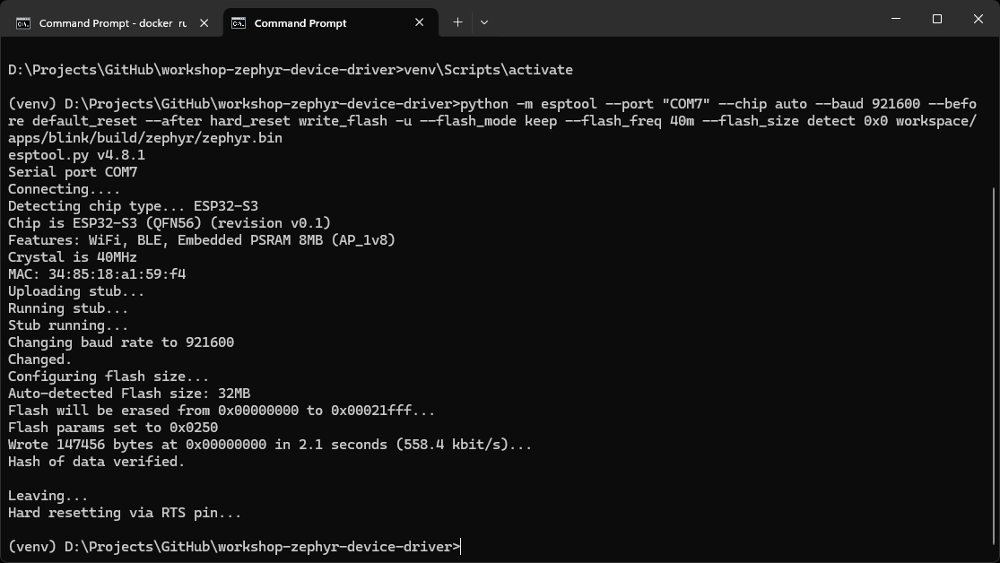
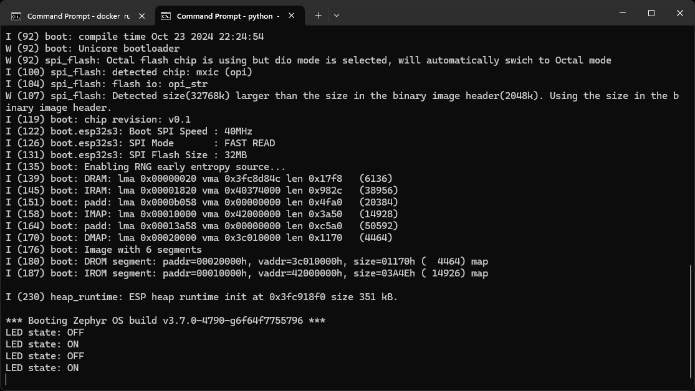

# Workshop: Zephyr Device Driver

Welcome to the Zephyr Device Driver workshop! By the end of this workshop, you should have a broad overview of how a device driver is written, connected to the Devicetree, and then used in a simple example application.

> **Note**: Writing a device driver involves multiple tools, languages, and configuration file syntaxes. If this is your first time working with Kconfig and Devicetree, know that it will likely be overwhelming at first. This workshop will provide you with a barebones example and then point you to various resources should you wish to dive deeper into these concepts.

> This workshop was tested with Zephyr RTOS v3.7.0.

## Table of Contents

**%%%TODO**

## Prerequisites

You should have an understanding of the following:

 * C programming langauge
 * Embedded development (e.g. what a GPIO pin is)
 * I<sup>2</sup>C communication

I recommend the following guides to refresh your knowledge:

 * [C structs](https://www.programiz.com/c-programming/c-structures)
 * [C pointers](https://www.programiz.com/c-programming/c-pointers)
 * [C macros](https://www.programiz.com/c-programming/c-preprocessor-macros)
 * [GPIO example with Zephyr](https://michaelangerer.dev/zephyr/2021/12/21/zephyr-basics-gpio.html)
 * [Overview of I2C](https://learn.sparkfun.com/tutorials/i2c/all)

The following concepts are optional but will help with your understanding of the hands-on portions of the workshop:

 * [Docker](https://www.digikey.com/en/maker/projects/getting-started-with-docker/aa0d4c708c274ffd975f3b427e5c0ce6)
 * [CMake](https://www.internalpointers.com/post/modern-cmake-beginner-introduction)
 * [Kconfig](https://docs.kernel.org/kbuild/kconfig-language.html)
 * [Devicetree](https://docs.nordicsemi.com/bundle/ncs-1.9.2-dev1/page/zephyr/guides/dts/intro.html)
 * [YAML](https://circleci.com/blog/what-is-yaml-a-beginner-s-guide/)

## Hardware Setup

You will need the following hardware components:

 * [ESP32-S3-DevKit-C-1](https://www.digikey.com/en/products/detail/espressif-systems/ESP32-S3-DEVKITC-1-N32R8V/15970965)
 * [MCP9808 Temperature Sensor Board](https://www.digikey.com/en/products/detail/adafruit-industries-llc/1782/4990781)
 * [LED](https://www.digikey.com/en/products/detail/w%C3%BCrth-elektronik/151051RS11000/4490012)
 * [220 Ω Resistor](https://www.digikey.com/en/products/detail/yageo/CFR-25JB-52-220R/1295?s=N4IgTCBcDa5gDARQEIGkC0A5AIiAugL5A)
 * [Jumper Wires](https://www.digikey.com/en/products/detail/adafruit-industries-llc/1957/6827090)
 * [Solderless Breadboard](https://www.digikey.com/en/products/detail/dfrobot/FIT0096/7597069)
 * [USB A to Micro B Cable](https://www.digikey.com/en/products/detail/cvilux-usa/DH-20M50055/13175849)

Connect the components as follows, and connect the ESP32 dev kit to your computer.

**%%%TODO: Fritzing image**

## Toolchain Installation

To start, download this repository somewhere on your computer (using `git` or direct download + unzip).

[The Zephyr Project](https://zephyrproject.org/) is not like other IDEs or toolchains: it relies a wide collection of tools with a strong focus on Linux as the host operating system. Windows and macOS are both officially supported, but installing the toolchains on them can be burdensome.

To create a unified experience for this workshop, this tutorial demonstrates everything using the [pre-made VS Code Docker image](https://github.com/ShawnHymel/vscode-env-zephyr).

> **Note**: In all cases, you should mount the *workspace/* directory from this repository into the container (which we do with the `-v` argument). That gives us a place to modify/save code so that you can take it with you after the workshop.

> **Warning**: I recommend deleting the container after using it (hence the `--rm` argument) to keep everything clean. Any changes in the container outside of the */workspace/* directory (which we mount from the host) **will be deleted**!

(Optional) If you do not want to use Docker, you are welcome to install Zephyr manually on your host operating system by [following these instructions](https://docs.zephyrproject.org/latest/develop/getting_started/index.html). Be warned: the installation locations might affect the flow of this workshop, and you will likely spend some time correcting paths. Zephyr, by default, wants you to install all the RTOS source code and SDK toolchains inside your single, large project. This is an extremely bloated way to develop one-off, smaller projects. As a result, we'll be using something similar to their [T3: Forest topology directory structure](https://docs.zephyrproject.org/latest/develop/west/workspaces.html#t3-forest-topology).

> **Note**: the instructions below were verified with Python 3.12 running on the host system. If one of the *pip install* steps fails, try installing exactly Python 3.12 and running the command again with `python3.12 -m pip install ...`

Before you start, install the following programs on your computer:

 * (Windows) [WSL 2](https://learn.microsoft.com/en-us/windows/wsl/install)
 * [Docker Desktop](https://www.docker.com/products/docker-desktop/)
 * [Python](https://www.python.org/downloads/)

Open a terminal, navigate to this directory, and install the following dependencies:

Linux/macOS:

```sh
cd workshop-zephyr-device-driver/
python -m venv venv
source venv/bin/activate
python -m pip install pyserial==3.5 esptool==4.8.1
```

Windows:

```bat
cd workshop-zephyr-device-driver/
python -m venv venv
venv\Scripts\activate
python -m pip install pyserial==3.5 esptool==4.8.1
```

**Option 1**: Build the Docker image (this will take some time):

```sh
docker build -t env-zephyr-espressif -f Dockerfile.espressif .
```

**Option 2**: Load a pre-made Docker image

If this is an in-person workshop, I should have USB flash drives with the necessary installers and pre-made images, as conference WiFi connections can sometimes be spotty. Copy the Docker image for your architecture (`*-amd64.tar` for x86_64 processors or `*-arm64.tar` for ARM64 processors like the Mac M1, M2, etc.) to your computer (e.g. *Downloads/* directory). Run the following command to load the Docker image (where `<ARCH>` is either `amd64` or `arm64`):

```sh
cd Downloads/
docker load -i env-zephyr-espressif-<ARCH>.tar
```

The Docker image includes all of the necessary Zephyr RTOS and SDK elements, the toolchain for building ESP32 applications, and a VS Code Server instance. As a result, you have a few options for interacting with the image: VS Code Server or Interactive Container. Choose one from below:

### (Recommended) VS Code Server

> **Note**: The rest of this tutorial assumes you will be using this method.

Open a terminal (or command prompt), navigate to this directory and run the Docker image:

Linux/macOS:

```sh
docker run --rm -it -p 8080:8080 -v "$(pwd)"/workspace:/workspace -w /workspace env-zephyr-espressif
```

Windows:

```bat
docker run --rm -it -p 8080:8080 -v "%cd%\workspace":/workspace -w /workspace env-zephyr-espressif
```

Leave that terminal window open, as it will act as our server. Open a browser on your host OS (verified working on Chrome) and navigate to [localhost:8080](http://localhost:8080/). It should connect to the container's server, and you should be presented with a VS Code instance.

### Interactive Container

If you don't want to use the VS Code server, your other option is to run an interactive container and edit your *workspace/* files locally (using your favorite editor) or in the container (using e.g. vim, nano, mcedit). To do that, override the entrypoint for the image:

Linux/macOS:

```sh
cd workshop-zephyr-device-driver/
docker run --rm -it -v "$(pwd)"/workspace:/workspace -w /workspace --entrypoint /bin/bash env-zephyr-espressif
```

Windows:

```bat
cd workshop-zephyr-device-driver/
docker run --rm -it -v "%cd%\workspace":/workspace -w /workspace --entrypoint /bin/bash env-zephyr-espressif
```

You should be presented with a root shell prompt (`#`) in your terminal. Remember that the */workspace/* directory is shared between your host and container, so any changes to files there are reflected on both systems. You can edit files locally (with e.g. your own local VS Code) or in the container (e.g. `mcedit /workspace/apps/blink/src/main.c`).

## Build and Flash the Blink Demo

Before we start driver development, let's make sure we can build the basic blinky demo.

> **Important!** Take note of the two directories in your VS Code instance:
> * ***/workspace*** is the shared directory between your host and container.
> * ***/opt/toolchains/zephyr*** is the Zephyr RTOS source code. It is for reference only and should not be modified!

Open a terminal in the VS Code client and build the project. Note that I'm using the [ESP32-S3-DevKitC](https://docs.espressif.com/projects/esp-idf/en/stable/esp32s3/hw-reference/esp32s3/user-guide-devkitc-1.html) as my target board. Feel free to change it to one of the [other ESP32 dev boards](https://docs.zephyrproject.org/latest/boards/index.html#vendor=espressif).

> **Note**: Whenever you see the root bash prompt (`#`), it means you should enter those commands into a terminal in the container (browser-based VS Code instance or root shell).

```
# cd apps/blink
# west build -p always -b esp32s3_devkitc/esp32s3/procpu
```

With some luck, the *blink* sample should build. Pay attention to any errors you see.


The binary files will be in *workspace/apps/blink/build/zephyr*, which you can flash using [esptool](https://docs.espressif.com/projects/esptool/en/latest/esp32/).

Connect the ESP32 board to your computer. In a new terminal on your **host computer**, activate the Python virtual environment (Linux/macOS: `source venv/bin/activate`, Windows: `venv\Scripts\activate`) if not done so already.

Flash the binary to your board. For some ESP32 boards, you need to put it into bootloader by holding the *BOOTSEL* button and pressing the *RESET* button (or cycling power). Change `<PORT>` to the serial port for your ESP32 board (e.g. `/dev/ttyS0` for Linux, `/dev/tty.usbserial-1420` for macOS, `COM7` for Windows). You might also need to install a serial port driver, depending on the particular board.

```sh
python -m esptool --port "<PORT>" --chip auto --baud 921600 --before default_reset --after hard_reset write_flash -u --flash_mode keep --flash_freq 40m --flash_size detect 0x0 workspace/apps/blink/build/zephyr/zephyr.bin
```



Open a serial port for debugging. Change `<PORT>` to the serial port for your ESP32 board.

```sh
python -m serial.tools.miniterm "<PORT>" 115200
```

You should see the LED state printed to the console. Exit with *ctrl+]* (or *cmd+]* for macOS).



## Driver Directory Structure

Drivers in Zephyr require a very particular directory structure, as the C compiler, CMake, Kconfig, and the Devicetree Compiler (DTC) browse through folders recursively looking for their respective source files. By default, Zephyr wants you to develop drivers and board Devicetree source (DTS) files "in-tree," which means inside the Zephyr RTOS source code repository (located at */opt/toolchains/zephyr* for this workshop).

For large projects, this might make sense: you fork the main Zephyr repository and make the changes you need in the actual source code. You would then version control your fork of the Zephyr source code (e.g. with [west](https://docs.zephyrproject.org/latest/develop/west/index.html)). For learning purposes, this is a pain.

We are going to develop our device driver "out-of-tree," which means it will be placed in a separate folder that we later tell CMake to find when building the project. This will help keep the application and driver folders free of clutter so you can see what's going on.

To start, create the following directory and file structure in the */workspace/modules/* directory. You can do this with the VS Code instance or using `mkdir` and `touch` in the terminal. Folders end with '/' and files do not. We're just creating a skeleton right now: the files can be empty.

```
/workspace/
|-- apps/
|   `-- blink/
|       `-- ...
`-- modules/
    |-- README.md
    `-- mcp9808/
        |-- CMakeLists.txt
        |-- Kconfig
        |-- drivers/
        |   |-- CMakeLists.txt
        |   |-- Kconfig
        |   `-- mcp9808/
        |       |-- CMakeLists.txt
        |       |-- Kconfig
        |       |-- mcp9808.c
        |       `-- mcp9808.h
        |-- dts/
        |   `-- bindings/
        |       `-- sensor/
        |           `-- microchip,mcp9808.yaml
        `-- zephyr/
            `-- module.yaml
```

Some notes about the files and folder structure:

 * We're keeping things separate: application code goes in *apps/* and driver code goes in *modules/*.
 * The *CMakeLists.txt* files tell the CMake build system where to find the code for our driver.
 * The *Kconfig* files create an entry in the Kconfig system that allows us to enable, disable, and configure our software components (i.e. the driver code).
 * The *mcp9808.c* and *mcp9808.h* files hold our actual device driver code.
 * The *microchip,mcp9808.yaml* file is our *Devicetree bindings* file. It is the glue that helps connect Devicetree settings (in DTS syntax) to our code (in C). It uses the [YAML syntax](https://docs.ansible.com/ansible/latest/reference_appendices/YAMLSyntax.html) and can end in *\*.yaml* or *\*.yml*. 
 * The *dts/bindings/sensor/* naming and structure matters. During the build process, Zephyr looks for bindings files (\*.yaml) recursively in *dts/bindings/* folders in its *modules*.
 * Speaking of modules, the *zephyr/module.yml* file formally declares this directory (*modules/mcp9808/*) as a Zephyr [module](https://docs.zephyrproject.org/latest/develop/modules.html) so it knows where to find the source, Kconfig, and bindings files. Once again, the folder and file name are important here: Zephyr looks for this particular file in this particular directory. It also uses the YAML syntax and must be named *module.yaml* or *module.yml*.

## Driver Source Code

## Devicetree Configuration

## CMake Includes

## Kconfig Settings

## Zephyr Module

## Demo Application

## License

This tutorial (README.md) is licensed under [CC BY 4.0](https://creativecommons.org/licenses/by/4.0/deed.en).

All software in this repository, unless otherwise noted, is licensed under [Apache-2.0](https://www.apache.org/licenses/LICENSE-2.0).
